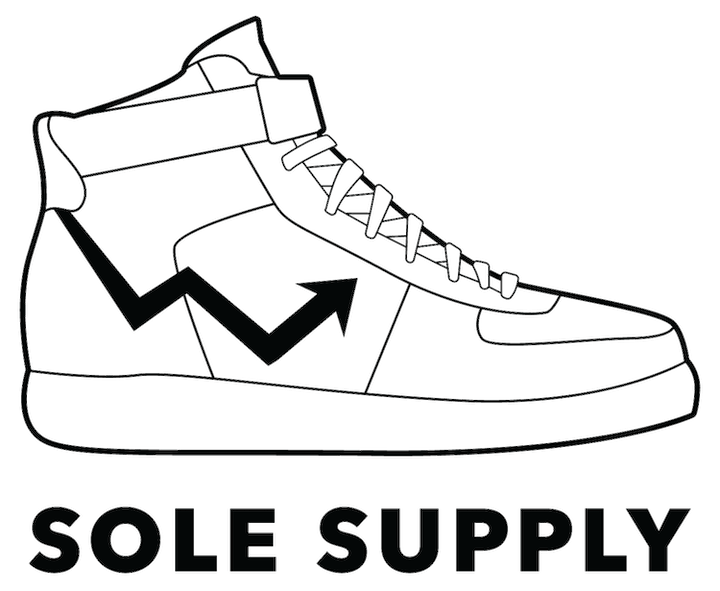

A tool to give a sneak peek into the future. Check it out [here!](https://solesupply.herokuapp.com/).

This project was built during a session at [Insight Data Science](https://insightdatascience.com/). I scraped over 2 million sneaker transactions from StockX's website, which contained detailed information on over 700 different shoes. From this raw data, I engineered features capturing date information, rolling metrics on the previous week of sales, and domain specific information about sneaker releases. To predict the future, I used Bayesian linear regression. I validated my model against a persistence model (in which the day's current volume is used to predict the future) and a random forest regression.

This repo contains the [scraping functions](https://github.com/allenchng/solesupply/tree/master/scraping_functions)), functions to [engineer features](https://github.com/allenchng/solesupply/blob/master/engineer_features.py), functions to [fit linear models](https://github.com/allenchng/solesupply/blob/master/bayes_linear_module.py) using the probabilistic programming language Stan, and functions to diagnose model fit / [visualize posterior distributions of features](https://github.com/allenchng/solesupply/blob/master/density_intervals.py). 

An demonstration of how the model is fit, as well as a visualization of important features, can be found in the accompanied [notebook](https://github.com/allenchng/solesupply/blob/master/BayesianLinReg.ipynb).

Logo graciously provided by [Bang Tran](https://www.bangctran.com/about)